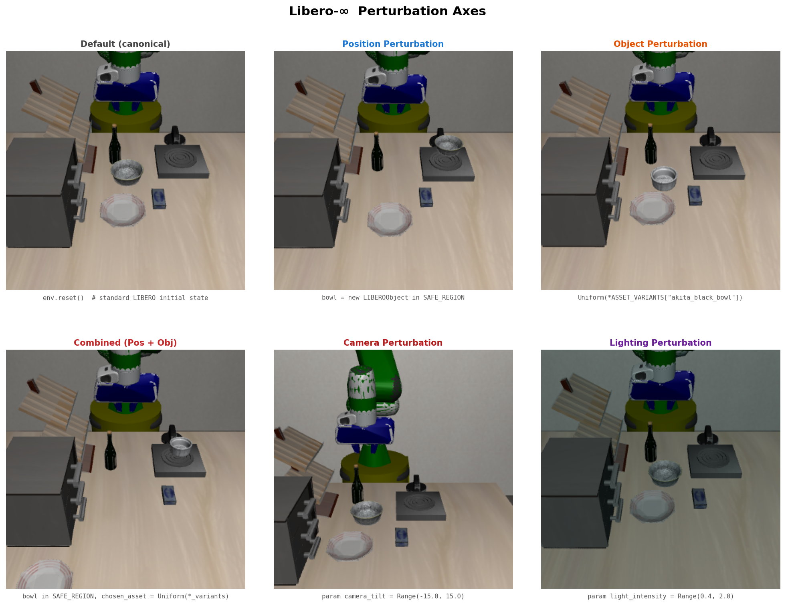
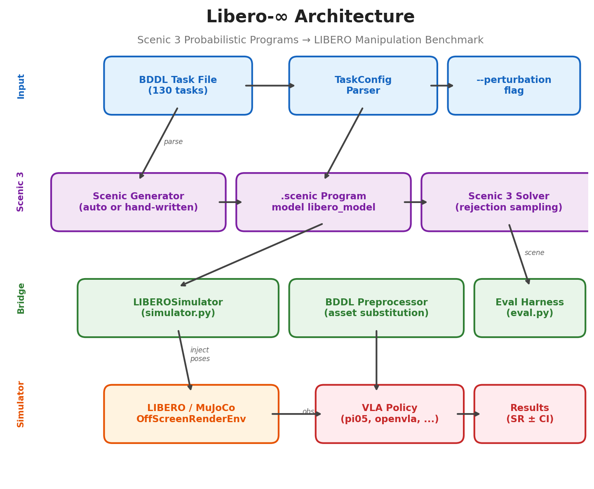

<div align="center">

# LIBERO-Infinity

### Open-Ended Robotic Manipulation Evaluation via Scenic 3 Probabilistic Programs

[](https://github.com/KE7/libero-infinity/actions/workflows/tests.yml)
[](LICENSE)
[](https://www.python.org/downloads/)
[](https://github.com/BerkeleyLearnVerify/Scenic)

**Libero-infinity brings Scenic 3 — UC Berkeley's probabilistic programming language for autonomous systems — to robot manipulation evaluation. Point at any LIBERO task; get infinite statistically-diverse test scenes.**

[Documentation](docs/) | [Blog Post](docs/blog_post.md) | [Quick Start](#quick-start)

</div>

---

<p align="center">
  
</p>
<p align="center"><em>Same task, eight perturbation axes — each showing the worst-case sample from its Scenic distribution. Every <code>reset()</code> draws a new scene.</em></p>

---

## Highlights

- **Open-Ended Evaluation** -- Sample unlimited i.i.d. test scenes from constraint-checked probability distributions; success rate converges to a true population statistic
- **8 Composable Perturbation Axes** -- Position, object identity, camera, lighting, texture, distractor objects, background, articulation -- mix any subset
- **Unlimited Tasks, Zero Hand-Writing** -- Point at any LIBERO BDDL task file; Scenic programs are synthesized automatically
- **Adversarial Search** -- Cross-entropy Bayesian optimization finds worst-case scenes via [VerifAI](https://github.com/BerkeleyLearnVerify/VerifAI)
- **Task Reversal** -- Flip any forward task backward for novel evaluation from goal-state initial configs
- **Gym API** -- Standard `gym.Env` wrapper with `make_vec_env` for RL/VLA training with built-in domain randomization

---

## Contents

- [Quick Start](#quick-start)
- [Perturbation Axes](#perturbation-axes)
- [Usage](#usage)
- [Architecture](#architecture)
- [Documentation](#documentation)
- [Citation](#citation)
- [License](#license)
- [Acknowledgments](#acknowledgments)

---

## Quick Start

### Prerequisites

| Tool | Purpose | Install |
|------|---------|---------|
| **Python 3.11+** | Runtime | [python.org](https://www.python.org/downloads/) |
| **[uv](https://docs.astral.sh/uv/)** | Package manager | `curl -LsSf https://astral.sh/uv/install.sh \| sh` |
| **make** | Build automation | Linux: `sudo apt install make` · macOS: `xcode-select --install` or `brew install make` |

> **No make?** See the *Without make* section below — all steps can be run with plain shell + `uv`.

### Installation

```bash
# 1. Install uv (fast Python package manager) — https://docs.astral.sh/uv/
curl -LsSf https://astral.sh/uv/install.sh | sh
# Fallback: pip install uv

# 2. Clone and install
git clone --recurse-submodules https://github.com/KE7/libero-infinity.git && cd libero-infinity
make install        # initializes submodule, creates venv, installs all deps
make setup-assets   # downloads LIBERO assets from HF (only needed once)
make test           # runs test suite (headless)
```

<details>
<summary><strong>Without make — raw equivalent commands</strong></summary>

```bash
git clone --recurse-submodules https://github.com/KE7/libero-infinity.git && cd libero-infinity

# Equivalent to: make install
git submodule update --init --recursive
uv venv --python 3.11
uv sync --extra dev
uv run pip install -e vendor/libero

# Equivalent to: make setup-assets
PYTHONPATH=src uv run python -c "from libero_infinity.runtime import ensure_runtime; ensure_runtime()"

# Equivalent to: make test
MUJOCO_GL=egl PYTHONPATH=src .venv/bin/python -m pytest tests/ -v

# Equivalent to: make test-fast  (no GPU required)
MUJOCO_GL=egl PYTHONPATH=src .venv/bin/python -m pytest tests/test_scenic.py tests/test_perturbation_policy.py tests/test_planner.py -v

# Equivalent to: make verify
MUJOCO_GL=egl uv run python scripts/verify_build.py
```

Or use the bundled convenience script (no make required):

```bash
./install.sh   # runs git submodule update + uv venv + uv sync + pip install -e vendor/libero
```

</details>

<details>
<summary><strong>Manual install (step-by-step)</strong></summary>

```bash
git clone --recurse-submodules https://github.com/KE7/libero-infinity.git
cd libero-infinity

# Create venv and install (vendor/libero submodule is initialized automatically)
git submodule update --init --recursive
uv venv --python 3.11
uv sync --extra dev
uv run pip install -e vendor/libero

# Download and validate HF assets, configure LIBERO runtime
PYTHONPATH=src uv run python -c "from libero_infinity.runtime import ensure_runtime; ensure_runtime()"

# Verify
MUJOCO_GL=egl uv run python -m pytest tests/test_e2e.py -v
```

</details>

<details>
<summary><strong>Platform support</strong></summary>

| Platform | Status | Notes |
|----------|--------|-------|
| Linux x86_64 | Fully supported | All wheels available from PyPI |
| Linux ARM64 (aarch64) | Fully supported | Vendored `python-fcl` stub |
| macOS Apple Silicon | Scenic installs natively | `python-fcl` has ARM64 macOS wheels |

Set `MUJOCO_GL=egl` on headless servers, `osmesa` if EGL is unavailable. On macOS, omit the variable.

</details>

### Run Your First Evaluation

```bash
# Connect a VLA via robo-eval, then run:
MUJOCO_GL=egl libero-eval \
  --bddl src/libero_infinity/data/libero_runtime/bddl_files/libero_goal/put_the_bowl_on_the_plate.bddl \
  --perturbation combined --n-scenes 5 --verbose
```

> **Note:** `libero-eval` requires a running robo-eval server — there is no built-in
> default policy. See `examples/05_robo_eval_cli.sh` to connect a VLA via the server,
> or use the Python API directly as shown below.

### Evaluate a Real Policy (Python API)

The Python API is the primary way to evaluate VLA policies. Here is a complete, copy-paste-ready
example using a HuggingFace VLA model:

```python
import numpy as np
from transformers import AutoModelForVision2Seq, AutoProcessor
from libero_infinity.eval import evaluate
from libero_infinity.task_config import TaskConfig
from libero_infinity.compiler import generate_scenic_file

# --- 1. Load your VLA model ---
model_id = "openvla/openvla-7b-finetuned-libero-spatial"
processor = AutoProcessor.from_pretrained(model_id, trust_remote_code=True)
model = AutoModelForVision2Seq.from_pretrained(
    model_id, torch_dtype="auto", device_map="auto", trust_remote_code=True
)

# --- 2. Define a policy callable: obs_dict -> action (7,) ---
def make_policy(instruction: str):
    """Create a policy closure that captures the task instruction."""
    def policy(obs: dict) -> np.ndarray:
        # Get the third-person camera image and flip to standard orientation
        image = obs["agentview_image"][::-1]  # OpenGL origin is bottom-left

        # Run VLA inference (model-specific — adapt to your model)
        inputs = processor(image, instruction).to(model.device)
        action = model.predict_action(**inputs)  # shape: (7,)

        # action format: [dx, dy, dz, dax, day, daz, gripper]
        # range: [-1, 1] per dimension (OSC_POSE controller)
        return np.array(action, dtype=np.float64)
    return policy

# --- 3. Iterate over all tasks in a benchmark suite ---
import glob

bddl_dir = "src/libero_infinity/data/libero_runtime/bddl_files/libero_spatial"
bddl_files = sorted(glob.glob(f"{bddl_dir}/*.bddl"))

for bddl_path in bddl_files:
    # Parse the task to get the language instruction
    cfg = TaskConfig.from_bddl(bddl_path)
    print(f"Task: {cfg.language}")

    # Create the policy with the task instruction
    policy = make_policy(cfg.language)

    # Auto-generate a Scenic perturbation program from the BDDL
    scenic_path = generate_scenic_file(cfg, perturbation="combined")

    # Evaluate on 50 perturbed scenes
    results = evaluate(
        scenic_path=scenic_path,
        bddl_path=bddl_path,
        policy=policy,
        n_scenes=50,
        max_steps=300,
        env_kwargs={"camera_heights": 224, "camera_widths": 224},  # match model resolution
        verbose=True,
    )
    print(results.summary())
    # -> "Success rate: 73.5% +/- 6.1% (147/200 scenes)"
```

`generate_scenic_file(...)` writes transient programs to `scenic/generated/` by
default. That directory is gitignored. Remove leftovers with `make clean-generated`.

<details>
<summary><strong>Measuring language contribution (counterfactual ablation)</strong></summary>

A key question for any VLA policy is how much it actually uses the language instruction vs. relying on visual shortcuts. Run the same perturbed scenes twice — once with the real instruction, once with an empty string — and compare:

```python
scenic_path = generate_scenic_file(cfg, perturbation="combined")

results_lang    = evaluate(scenic_path, bddl_path, make_policy(cfg.language), n_scenes=50)
results_no_lang = evaluate(scenic_path, bddl_path, make_policy(""),           n_scenes=50)

lang_contribution = results_lang.success_rate - results_no_lang.success_rate
print(f"With language:    {results_lang.success_rate:.1%}")
print(f"Vision-only:      {results_no_lang.success_rate:.1%}")
print(f"Language contrib: {lang_contribution:+.1%}")
# A small gap means the policy is ignoring your instructions.
# cf. VLA-VA (arXiv 2602.17659) Table I: OpenVLA-OFT scores 83% vision-only vs. 97% full.
```

Because the instruction is captured in your policy closure, not passed through our eval loop, this requires no special flags — just two `evaluate()` calls with different policy closures.

</details>

<details>
<summary><strong>Handling action chunks (e.g., pi0.5 outputs 50 actions at once)</strong></summary>

Some VLA models output multiple actions per inference (action chunks). Execute them
sequentially before querying the model again:

```python
def make_chunked_policy(instruction: str, chunk_size: int = 50):
    """Policy wrapper for models that output action chunks."""
    action_queue = []

    def policy(obs: dict) -> np.ndarray:
        nonlocal action_queue
        if not action_queue:
            # Query the model for a new chunk of actions
            actions = my_vla_model.predict(obs, instruction)  # shape: (chunk_size, 7)
            action_queue = list(actions)
        return action_queue.pop(0)
    return policy
```

</details>

See [docs/observations-actions.md](docs/observations-actions.md) for the full policy interface
details (obs keys, action format, task instructions).

See [docs/installation.md](docs/installation.md) for detailed setup instructions and [docs/evaluation_pipeline.md](docs/evaluation_pipeline.md) for the full CLI reference.

---

## Perturbation Axes

LIBERO-Infinity provides **eight composable perturbation axes**, each defined as a [Scenic 3](https://github.com/BerkeleyLearnVerify/Scenic) distribution with constraint checking via rejection sampling.

| Axis | What Varies | Distribution | Constraints |
|------|------------|-------------|-------------|
| **Position** | Object (x, y) placement | Uniform over reachable workspace | Pairwise clearance > 0.10 m; soft OOD bias |
| **Object** | Visual identity (mesh + texture) | Uniform over 34 asset variant pools | BDDL rewriting for asset substitution |
| **Camera** | Viewpoint position and tilt | Position offsets +/- 0.10 m; tilt +/- 15 deg | Applied to agentview camera quaternion |
| **Lighting** | Scene illumination | Intensity [0.4, 2.0]; ambient [0.05, 0.6] | Applied to all MuJoCo lights |
| **Texture** | Table surface material | Named or random texture swap | MuJoCo material ID replacement |
| **Distractor** | Scene clutter objects | 1-5 non-task objects from pool | Clearance constraints to task objects |
| **Background** | Wall and floor texture | Uniform over 35 LIBERO texture assets | Applied via MuJoCo texture ID lookup with random fallback |
| **Articulation** | Initial fixture state (doors, drawers, stoves) | Range-based per fixture family | Goal-reachability enforced; containers open when goal requires interior access |

All axes are **arbitrarily composable** -- specify any combination:

```bash
--perturbation position                    # single axis
--perturbation position,camera             # two axes
--perturbation object,lighting,distractor  # three axes
--perturbation combined                    # preset: position + object
--perturbation full                        # all axes
```

See [docs/scenic_perturbations.md](docs/scenic_perturbations.md) for full parameter details, Scenic code examples, and more screenshots.

---

## How It Works

LIBERO-Infinity is organized as a three-layer pipeline:

```
BDDL task file
     │  task_config.py parses objects, fixtures, regions
     ▼
Scenic 3 program  (auto-generated or hand-written)
     │  Scenic rejection sampler draws a scene
     ▼
MuJoCo simulation  (via LIBERO + robosuite)
     │  Policy rolls out; success/failure recorded
     ▼
Aggregate statistics with 95% Wilson confidence intervals
```

| Layer | Component | Role |
|-------|-----------|------|
| **BDDL** | Any LIBERO `.bddl` file | Specifies objects, regions, and goal predicates |
| **Scenic 3** | `scenic/*.scenic` + auto-generator | Defines probability distributions with constraint checking |
| **MuJoCo** | `simulator.py` bridge | Injects sampled poses, applies perturbations, steps physics |


---

## Usage

### CLI Evaluation

```bash
# Standard evaluation (i.i.d. sampling with confidence intervals)
libero-eval --bddl path/to/task.bddl --perturbation full --n-scenes 200 --verbose

# Adversarial search for worst-case scenes
libero-eval --bddl path/to/task.bddl --mode adversarial --n-scenes 200

# Reversed task (goal becomes initial state)
libero-eval --bddl path/to/task.bddl --reverse --perturbation position --n-scenes 100

# Live visualization (requires DISPLAY)
libero-eval --bddl path/to/task.bddl --n-scenes 5 --watch cv2 --verbose
```

### Python API

```python
from libero_infinity.eval import evaluate

results = evaluate(
    scenic_path="scenic/combined_perturbation.scenic",
    bddl_path="path/to/task.bddl",
    policy=my_policy_fn,     # (obs_dict) -> action_array (7,)
    n_scenes=200,
    verbose=True,
)
print(results.summary())
# -> "Success rate: 73.5% +/- 6.1% (147/200 scenes)"
```

### Gym Environment

```python
from libero_infinity.gym_env import LIBEROScenicEnv, make_vec_env

# Single environment -- each reset() samples a new perturbed scene
env = LIBEROScenicEnv(
    bddl_path="path/to/task.bddl",
    perturbation="combined",
    resolution=256,
)
obs = env.reset()
for _ in range(300):
    action = my_policy(obs)
    obs, reward, done, info = env.step(action)
    if done:
        break
env.close()

# Parallel rollouts (subprocess-based)
vec_env = make_vec_env("path/to/task.bddl", n_envs=8, perturbation="full")
```

See [docs/evaluation_pipeline.md](docs/evaluation_pipeline.md) for the complete CLI reference.

---

## Architecture

<p align="center">
  
</p>

### Layered Scenic Design

| Layer | Component | Role |
|-------|-----------|------|
| **Layer 3** | `scenic/*.scenic` | Perturbation programs -- define what varies and what constraints hold |
| **Layer 2** | `scenic/libero_model.scenic` | World vocabulary -- `LIBEROObject`, table geometry, asset registry |
| **Layer 1** | `src/libero_infinity/simulator.py` | Scenic-MuJoCo bridge -- pose injection, perturbations, policy stepping |

See [docs/architecture.md](docs/architecture.md) for detailed diagrams and design decisions.

---

## Observation and Action Spaces

| | Details |
|--|---------|
| **Visual** | `agentview_image` (H,W,3), `robot0_eye_in_hand_image` (H,W,3) -- configurable resolution |
| **Proprioception** | `robot0_joint_pos` (7,), `robot0_eef_pos` (3,), `robot0_proprio-state` (39,), ... |
| **Action** | 7D `[-1,1]`: 3 position delta + 3 orientation delta + 1 gripper (OSC_POSE) |

See [docs/observations-actions.md](docs/observations-actions.md) for the full schema and policy interface.

---

## Documentation

| Document | Contents |
|----------|----------|
| [Installation](docs/installation.md) | Detailed setup guide, platform support, troubleshooting |
| [Scenic Perturbations](docs/scenic_perturbations.md) | All 8 perturbation axes -- parameters, constraints, screenshots |
| [Evaluation Pipeline](docs/evaluation_pipeline.md) | Eval harness, CLI flags, adversarial mode, technical details |
| [Architecture](docs/architecture.md) | System diagrams, design decisions, file map |
| [Gym Wrapper](docs/gym-wrapper.md) | Gym env for RL/VLA training, parallel rollouts |
| [Task Reversal](docs/task-reversal.md) | Backward evaluation -- reversal rules, stacking, language rewriting |
| [Observations & Actions](docs/observations-actions.md) | Full obs/action space schema, policy interface |
| [API Reference](docs/api-reference.md) | Python API for all modules |
| [Blog Post](docs/blog_post.md) | Motivation, design, and comparison with related work |
| [Contributing](docs/contributing.md) | How to contribute to the project |

---

## Links

| Resource | URL |
|----------|-----|
| **LIBERO-Infinity** (this project) | [github.com/KE7/libero-infinity](https://github.com/KE7/libero-infinity) |
| **LIBERO** (original benchmark) | [github.com/Lifelong-Robot-Learning/LIBERO](https://github.com/Lifelong-Robot-Learning/LIBERO) |
| **LIBERO-PRO** (prior work, cited) | [github.com/Zxy-MLlab/LIBERO-PRO](https://github.com/Zxy-MLlab/LIBERO-PRO) |
| **Scenic 3** (probabilistic programming) | [github.com/BerkeleyLearnVerify/Scenic](https://github.com/BerkeleyLearnVerify/Scenic) |
| **VerifAI** (adversarial search) | [github.com/BerkeleyLearnVerify/VerifAI](https://github.com/BerkeleyLearnVerify/VerifAI) |

---

## Glossary

| Term | Definition |
|------|------------|
| **BDDL** | Behavior Description Definition Language — a declarative format for specifying manipulation tasks (objects, regions, goals) used by LIBERO |
| **Scenic 3** | A probabilistic programming language for defining distributions over environments, developed at UC Berkeley. LIBERO-Infinity uses Scenic to specify perturbation distributions with constraint checking |
| **i.i.d.** | Independent and identically distributed — each test scene is sampled independently from the same distribution, ensuring statistical validity |
| **OSC_POSE** | Operational Space Controller in pose mode — the low-level controller that converts 7D action commands into robot joint torques |
| **Wilson 95% CI** | Wilson score confidence interval — a method for computing confidence intervals on proportions (success rates) that is accurate even with small sample sizes or extreme proportions |
| **Cross-entropy optimization** | A Bayesian optimization method used for adversarial scene search. The sampler iteratively concentrates on failure-inducing regions of the scene distribution by fitting to worst-case episodes. Requires [VerifAI](https://github.com/BerkeleyLearnVerify/VerifAI) |
| **VLA** | Vision-Language-Action model — a neural network that takes visual observations and language instructions as input and outputs robot actions |

---

## Citation

If you find **LIBERO-Infinity** useful in your research, please consider citing:

```bibtex
@article{libero_infinity2026,
  title     = {LIBERO-Infinity: Open-Ended Robotic Manipulation Evaluation
               via Scenic 3 Probabilistic Programs},
  author    = {Karim Elmaaroufi and OMAR and Matei Zaharia and Sanjit A. Seshia},
  year      = {2026},
}
```

> LIBERO-Infinity is introduced in the OMAR blog post: [Introducing OMAR](https://omarmy.ai/blog/introducing-omar/) by **OMAR (One Man Army)**.

If you use the LIBERO benchmark tasks, please also cite:

```bibtex
@article{liu2023libero,
  title   = {LIBERO: Benchmarking Knowledge Transfer for Lifelong Robot Learning},
  author  = {Liu, Bo and Zhu, Yifeng and Gao, Chongkai and Feng, Yihao
             and Liu, Qiang and Zhu, Yuke and Stone, Peter},
  journal = {arXiv preprint arXiv:2306.03310},
  year    = {2023}
}
```

---

## License

| Component | License |
|-----------|---------|
| LIBERO-Infinity codebase | [MIT License](LICENSE) |
| LIBERO (upstream) | [MIT License](vendor/libero/LICENSE) |

---

## Acknowledgments

LIBERO-Infinity is built directly on top of the [LIBERO](https://libero-project.github.io) codebase
(vendored at `vendor/libero/`, MIT License © 2023 Lifelong Robot Learning) and inherits its full
3D asset pack, including all assets originally attributed by LIBERO to their respective sources.
We thank Bo Liu, Yifeng Zhu, and the LIBERO team (Yang et al., 2023) for building and open-sourcing
the benchmark that makes this work possible.

The probabilistic programming layer of LIBERO-Infinity is built on [Scenic 3](https://scenic-lang.readthedocs.io),
the scenario specification language developed at UC Berkeley by Daniel Fremont, Tommaso Dreossi,
Shromona Ghosh, Xiangyu Yue, Alberto Sangiovanni-Vincentelli, and Sanjit A. Seshia
(Fremont et al., 2023). Scenic's constraint-checking rejection sampler is what makes
open-ended, physically-plausible scene distributions possible.

We acknowledge the [LIBERO-PRO](https://github.com/Zxy-MLlab/LIBERO-PRO) team for their prior work on
VLA robustness evaluation, which helped motivate this work. LIBERO-Infinity also uses the
[MuJoCo](https://mujoco.org) physics engine.

Some 3D assets are sourced from the [Google Scanned Objects](https://research.google/tools/datasets/scanned-objects-by-google/) dataset,
licensed under [CC BY 4.0](https://creativecommons.org/licenses/by/4.0/).

---

<div align="center">
  <sub>Built for the robotics research community</sub>
</div>
