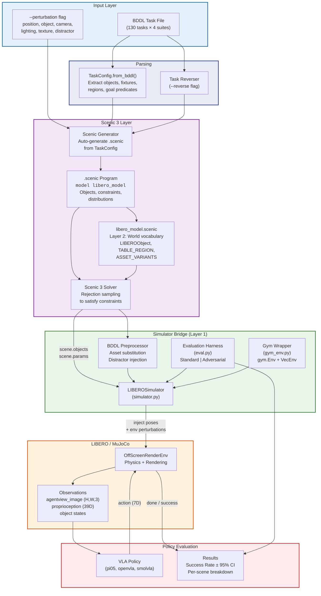
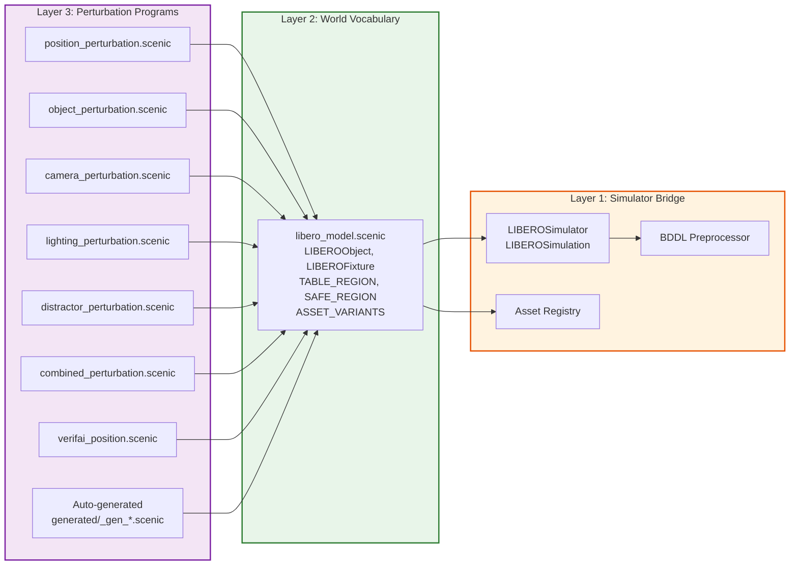
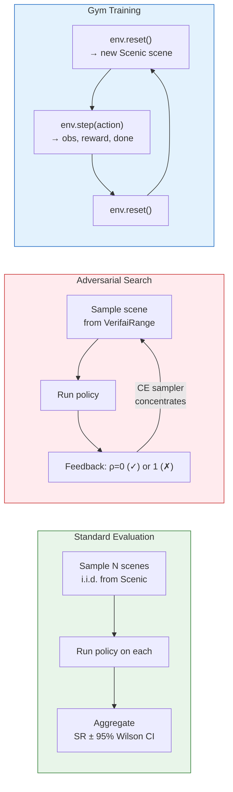

# LIBERO-Infinity Architecture Diagram

## System Pipeline

```mermaid
flowchart TD
    subgraph Input["Input Layer"]
        BDDL["BDDL Task File<br/>(130 tasks × 4 suites)"]
        FLAG["--perturbation flag<br/>position, object, camera,<br/>lighting, texture, distractor"]
    end

    subgraph Parse["Parsing"]
        TC["TaskConfig.from_bddl()<br/>Extract objects, fixtures,<br/>regions, goal predicates"]
        TR["Task Reverser<br/>(--reverse flag)"]
    end

    subgraph Scenic["Scenic 3 Layer"]
        SG["Scenic Generator<br/>Auto-generate .scenic<br/>from TaskConfig"]
        SP[".scenic Program<br/><code>model libero_model</code><br/>Objects, constraints,<br/>distributions"]
        LM["libero_model.scenic<br/>Layer 2: World vocabulary<br/>LIBEROObject, TABLE_REGION,<br/>ASSET_VARIANTS"]
        CS["Scenic 3 Solver<br/>Rejection sampling<br/>to satisfy constraints"]
    end

    subgraph Bridge["Simulator Bridge (Layer 1)"]
        SIM["LIBEROSimulator<br/>(simulator.py)"]
        BDDLP["BDDL Preprocessor<br/>Asset substitution<br/>Distractor injection"]
        EVAL["Evaluation Harness<br/>(eval.py)<br/>Standard | Adversarial"]
        GYM["Gym Wrapper<br/>(gym_env.py)<br/>gym.Env + VecEnv"]
    end

    subgraph Engine["LIBERO / MuJoCo"]
        ENV["OffScreenRenderEnv<br/>Physics + Rendering"]
        OBS["Observations<br/>agentview_image (H,W,3)<br/>proprioception (39D)<br/>object states"]
    end

    subgraph Policy["Policy Evaluation"]
        VLA["VLA Policy<br/>(pi05, openvla, smolvla)"]
        RES["Results<br/>Success Rate ± 95% CI<br/>Per-scene breakdown"]
    end

    BDDL --> TC
    BDDL --> TR
    FLAG --> SG
    TC --> SG
    TR --> SG
    SG --> SP
    SP --> LM
    SP --> CS
    LM --> CS
    CS -->|"scene.objects<br/>scene.params"| SIM
    CS --> BDDLP
    BDDLP --> SIM
    SIM -->|"inject poses<br/>+ env perturbations"| ENV
    EVAL --> SIM
    GYM --> SIM
    ENV --> OBS
    OBS --> VLA
    VLA -->|"action (7D)"| ENV
    ENV -->|"done / success"| RES
    EVAL --> RES

    style Input fill:#E3F2FD,stroke:#1565C0,stroke-width:2px
    style Parse fill:#E8EAF6,stroke:#283593,stroke-width:2px
    style Scenic fill:#F3E5F5,stroke:#7B1FA2,stroke-width:2px
    style Bridge fill:#E8F5E9,stroke:#2E7D32,stroke-width:2px
    style Engine fill:#FFF3E0,stroke:#E65100,stroke-width:2px
    style Policy fill:#FFEBEE,stroke:#C62828,stroke-width:2px
```

## Layered Design

```mermaid
graph LR
    subgraph L3["Layer 3: Perturbation Programs"]
        P1["position_perturbation.scenic"]
        P2["object_perturbation.scenic"]
        P3["camera_perturbation.scenic"]
        P4["lighting_perturbation.scenic"]
        P5["distractor_perturbation.scenic"]
        P6["combined_perturbation.scenic"]
        P7["verifai_position.scenic"]
        PG["Auto-generated<br/>generated/_gen_*.scenic"]
    end

    subgraph L2["Layer 2: World Vocabulary"]
        LM["libero_model.scenic<br/>LIBEROObject, LIBEROFixture<br/>TABLE_REGION, SAFE_REGION<br/>ASSET_VARIANTS"]
    end

    subgraph L1["Layer 1: Simulator Bridge"]
        SIM["LIBEROSimulator<br/>LIBEROSimulation"]
        PP["BDDL Preprocessor"]
        AR["Asset Registry"]
    end

    P1 --> LM
    P2 --> LM
    P3 --> LM
    P4 --> LM
    P5 --> LM
    P6 --> LM
    P7 --> LM
    PG --> LM
    LM --> SIM
    LM --> AR
    SIM --> PP

    style L3 fill:#F3E5F5,stroke:#7B1FA2,stroke-width:2px
    style L2 fill:#E8F5E9,stroke:#2E7D32,stroke-width:2px
    style L1 fill:#FFF3E0,stroke:#E65100,stroke-width:2px
```

## Evaluation Modes

```mermaid
flowchart LR
    subgraph Standard["Standard Evaluation"]
        S1["Sample N scenes<br/>i.i.d. from Scenic"] --> S2["Run policy on each"] --> S3["Aggregate<br/>SR ± 95% Wilson CI"]
    end

    subgraph Adversarial["Adversarial Search"]
        A1["Sample scene<br/>from VerifaiRange"] --> A2["Run policy"] --> A3["Feedback: ρ=0 (✓) or 1 (✗)"]
        A3 -->|"CE sampler<br/>concentrates"| A1
    end

    subgraph GymMode["Gym Training"]
        G1["env.reset()<br/>→ new Scenic scene"] --> G2["env.step(action)<br/>→ obs, reward, done"] --> G3["env.reset()"]
        G3 --> G1
    end

    style Standard fill:#E8F5E9,stroke:#2E7D32
    style Adversarial fill:#FFEBEE,stroke:#C62828
    style GymMode fill:#E3F2FD,stroke:#1565C0
```

## Rendered Architecture Diagram

