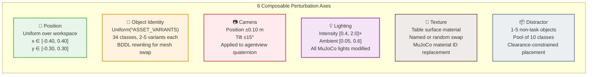
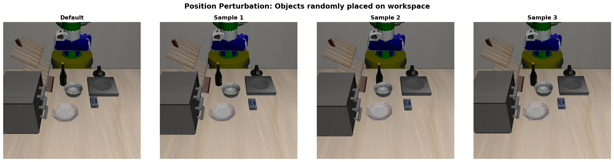
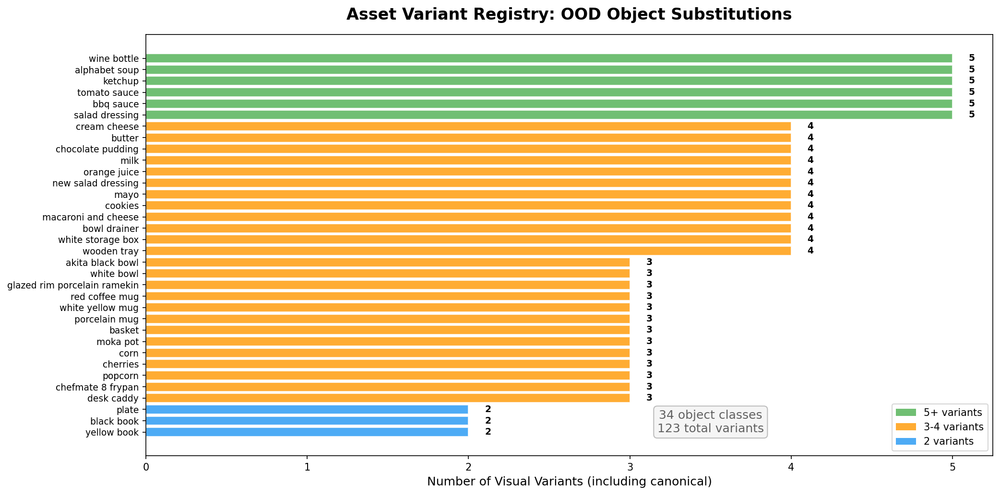
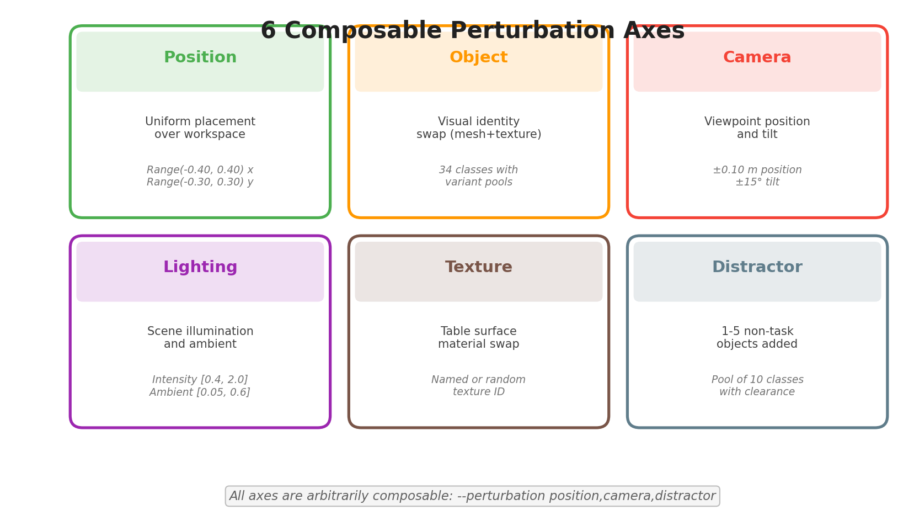
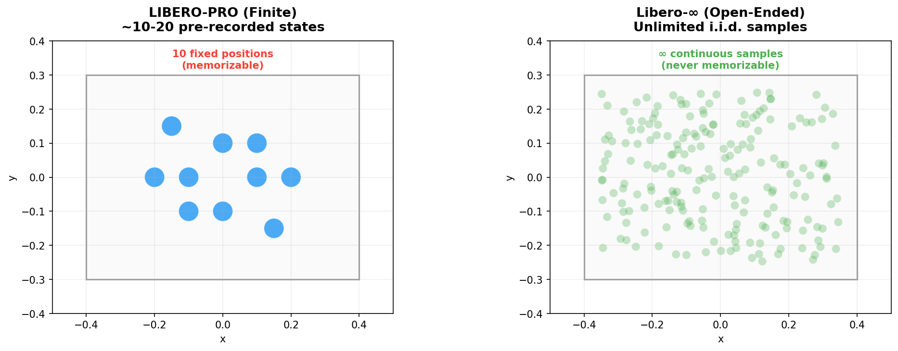
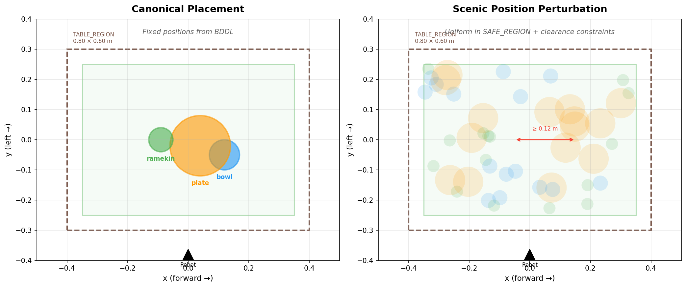

# LIBERO-Infinity Perturbation Types

## Overview

LIBERO-Infinity provides **6 composable perturbation axes**, each implemented as a
Scenic 3 probabilistic program with explicit constraint checking via rejection sampling.


## Perturbation Axes Detail



---

## 1. Position Perturbation

**What varies:** Object (x, y) placement on the workspace table.

**Distribution:** Uniform over `SAFE_REGION` (0.70 × 0.50 m inset workspace).

**Constraints:**
- Hard: pairwise clearance > 0.12 m between all objects
- Hard: workspace boundary (enforced by `in SAFE_REGION`)
- Soft: 80% probability of being > 0.15 m from training position (OOD bias)

**Scenic syntax:**
```scenic
bowl = new LIBEROObject with libero_name "akita_black_bowl_1",
                         in SAFE_REGION
require (distance from bowl to plate) > _min_clearance
require[0.8] distance from bowl to bowl_train_pt > _ood_margin
```



---

## 2. Object Identity Perturbation

**What varies:** Visual identity (mesh + texture) of task objects.

**Distribution:** `Uniform(*ASSET_VARIANTS[class])` — draws from per-class variant pools.

**Registry:** 34 object classes with 2-5 visual variants each.

**Mechanism:**
1. Scenic samples a replacement asset class
2. BDDL preprocessor rewrites `(:objects ...)` block
3. LIBERO reloads environment with swapped MuJoCo mesh/material

**Scenic syntax:**
```scenic
chosen_asset = Uniform(*_variants)
bowl = new LIBEROObject with asset_class chosen_asset, ...
```



---

## 3. Camera Perturbation

**What varies:** Agentview camera position and tilt angle.

**Distribution:**
- Position offsets: `Range(-0.10, 0.10)` m in x, y, z
- Tilt: `Range(-15, 15)` degrees around camera x-axis

**Mechanism:** Applied post-reset by modifying `sim.model.cam_pos` and `sim.model.cam_quat`.

---

## 4. Lighting Perturbation

**What varies:** Scene illumination intensity and ambient light level.

**Distribution:**
- Intensity multiplier: `Range(0.4, 2.0)` (1.0 = default)
- Light position offsets: `Range(-0.5, 0.5)` m
- Ambient level: `Range(0.05, 0.6)` (0.0 = dark, 1.0 = bright)

**Mechanism:** Modifies `sim.model.light_diffuse`, `sim.model.light_specular`, `sim.model.vis.headlight.ambient`.

---

## 5. Texture Perturbation

**What varies:** Table surface material appearance.

**Mechanism:** Swaps MuJoCo `mat_texid` for table body geoms. Can use a named texture or random selection from available textures.

---

## 6. Distractor Object Perturbation

**What varies:** 1-5 non-task objects are injected into the scene.

**Distribution:**
- Count: `DiscreteRange(1, 5)` active distractors
- Classes: `Uniform(*pool)` from 10 graspable object classes
- Positions: `in SAFE_REGION` with clearance constraints

**Object pool:** cream_cheese, butter, chocolate_pudding, alphabet_soup, popcorn, cookies, ketchup, macaroni_and_cheese, desk_caddy, bowl_drainer

**Mechanism:**
1. Scenic creates 5 distractor slots (max)
2. Only first N slots are injected into MuJoCo via BDDL patching
3. Positions come from Scenic's constraint solver

---

## Composability

All axes are **arbitrarily composable** via the `--perturbation` CLI flag:

```bash
# Single axis
libero-eval --bddl task.bddl --perturbation position

# Multiple axes
libero-eval --bddl task.bddl --perturbation position,camera,distractor

# Presets
libero-eval --bddl task.bddl --perturbation combined  # position + object
libero-eval --bddl task.bddl --perturbation full       # all axes
```



---

## Comparison: Finite vs Infinite Evaluation



| Dimension | LIBERO-PRO (Finite) | LIBERO-Infinity (Open-Ended) |
|-----------|--------------------|-----------------------|
| Position  | 10 swap pairs | Continuous uniform over workspace |
| Object    | 2-6 static replacements | 34 classes, sampled per scene |
| Camera    | Fixed | Range-based per scene |
| Lighting  | Fixed | Range-based per scene |
| Composability | Each axis isolated | Any subset composable |
| Adversarial | Not supported | Cross-entropy feedback loop |

---

## Workspace Layout



### Coordinate System (MuJoCo world frame)
- **+x** → forward (away from robot)
- **+y** → left
- **+z** → up
- **Origin:** table centre projected onto the floor
- **Table surface:** z ≈ 0.82 m

### Workspace Limits
- x ∈ [-0.40, 0.40] (TABLE_WIDTH = 0.80 m)
- y ∈ [-0.30, 0.30] (TABLE_LENGTH = 0.60 m)
- SAFE_REGION: 0.05 m inset (for robot reachability)
- PLATE_SAFE_REGION: 0.08 m inset (for large objects)
