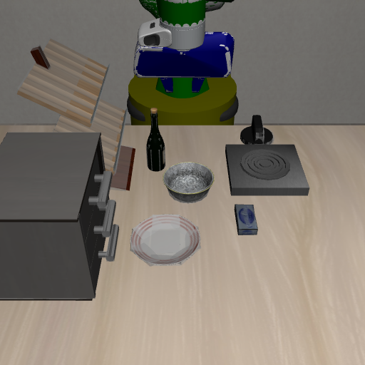
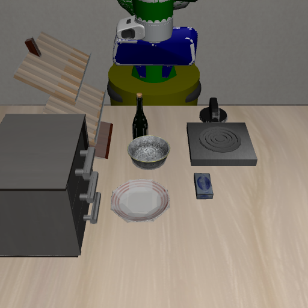
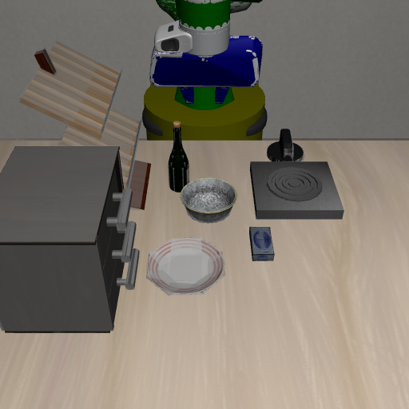
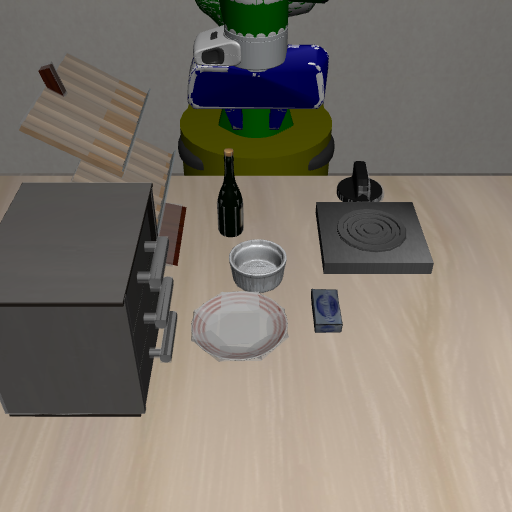
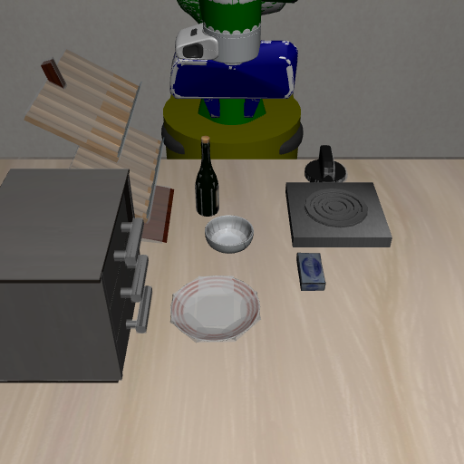
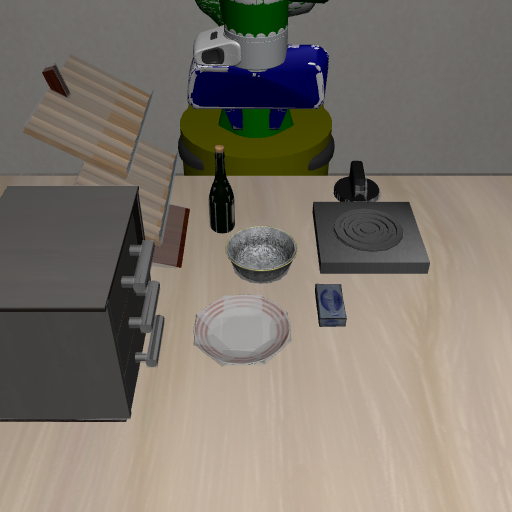
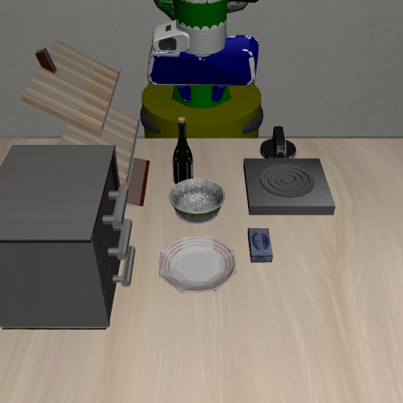
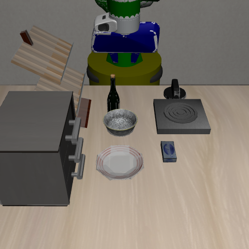
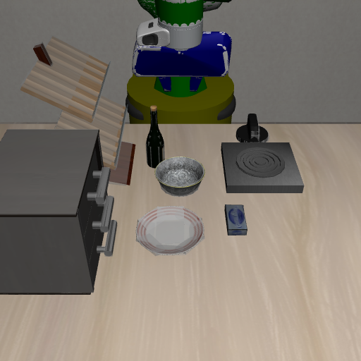
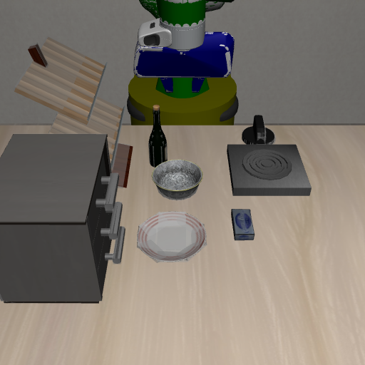

# Scenic Perturbations Guide

[Back to main README](../README.md)

LIBERO-Infinity provides **eight composable perturbation axes**, each defined as a Scenic 3
distribution with explicit constraint checking via rejection sampling. This document covers
all axes in detail with parameters, examples, and screenshots.

---

## Overview

| Axis | What Varies | Scenic File | Key Parameters |
|------|------------|-------------|----------------|
| [Position](#position-perturbation) | Object (x, y) placement | `position_perturbation.scenic` | `min_clearance`, `ood_margin` |
| [Object](#object-perturbation) | Visual identity (mesh + texture) | `object_perturbation.scenic` | `perturb_class`, `include_canonical` |
| [Camera](#camera-perturbation) | Viewpoint position and tilt | `camera_perturbation.scenic` | `camera_*_offset`, `camera_tilt` |
| [Lighting](#lighting-perturbation) | Scene illumination | `lighting_perturbation.scenic` | `light_intensity`, `ambient_level` |
| [Texture](#texture-perturbation) | Table surface material | *(via Scenic params)* | `table_texture` |
| [Distractor](#distractor-objects) | Scene clutter objects | `distractor_perturbation.scenic` | `n_distractors`, `distractor_clearance` |
| [Background](#background-perturbation) | Wall and floor textures | *(via Scenic params)* | `wall_texture`, `floor_texture` |
| [Articulation](#articulation-perturbation) | Initial fixture state (doors, drawers, stoves) | *(via planner)* | `state_kind`, `lo`, `hi` |

### Composing Axes

All axes are arbitrarily composable:

```bash
--perturbation position                    # single axis
--perturbation position,camera             # two axes
--perturbation object,lighting,distractor  # three axes
--perturbation combined                    # preset: position + object
--perturbation full                        # all axes
```

---

## Position Perturbation

**File:** `scenic/position_perturbation.scenic`

Samples object positions from a continuous uniform distribution over the full reachable
workspace, using Scenic 3's rejection sampler to enforce physical-plausibility constraints.

### Screenshots

<table>
<tr>
<td align="center"><strong>Default</strong></td>
<td align="center"><strong>Perturbed 1</strong></td>
<td align="center"><strong>Perturbed 2</strong></td>
<td align="center"><strong>Perturbed 3</strong></td>
</tr>
<tr>
<td></td>
<td></td>
<td></td>
<td></td>
</tr>
</table>

### Distribution

Each object's (x, y) is drawn independently and uniformly from:
- `x in [-0.40, 0.40]`, `y in [-0.30, 0.30]`, `z = 0.82 m` (table surface)

### Constraints

| Constraint | Type | What it enforces |
|-----------|------|-----------------|
| `distance from A to B > 0.12 m` | Hard | Objects cannot physically overlap |
| `bowl.position.x in (-0.35, 0.35)` | Hard | Stay in arm's reachable inner zone |
| `distance from bowl to training_pos > 0.15 m` | Soft p=0.8 | Prefer OOD positions |
| `distance from plate to training_pos > 0.15 m` | Soft p=0.7 | Prefer OOD positions |

The soft constraints implement an **anti-canonical bias**: positions near the training
pose are down-weighted but not forbidden.

### Parameters

| Parameter | Default | Description |
|-----------|---------|-------------|
| `min_clearance` | `0.12` | Minimum pairwise clearance (metres) |
| `ood_margin` | `0.15` | Soft OOD distance from training position |
| `bowl_train_x`, `bowl_train_y` | `0.12, -0.05` | Training position for OOD bias |
| `plate_train_x`, `plate_train_y` | `0.04, -0.02` | Training position for OOD bias |

Auto-generated position programs from `generate_scenic_file(cfg, perturbation="position")`
also move goal fixtures such as drawers, stoves, microwaves, and cabinets when the
task goal is fixture-backed. The hand-written `scenic/position_perturbation.scenic`
now supports the same pattern via optional `goal_fixture_*` params.

### Example

```python
import scenic

scenario = scenic.scenarioFromFile(
    "scenic/position_perturbation.scenic",
    params={
        "bddl_path": "src/libero_infinity/data/libero_runtime/bddl_files/libero_goal/"
                     "put_the_bowl_on_the_plate.bddl",
        "min_clearance": 0.12,
        "ood_margin": 0.15,
    },
)
scene, n_iters = scenario.generate(maxIterations=2000)
for obj in scene.objects:
    if obj.libero_name:
        print(f"{obj.libero_name}: ({obj.position.x:.3f}, {obj.position.y:.3f})")
```

Generated files are written to `scenic/generated/` by default and can be removed with
`make clean-generated`.

---

## Object Perturbation

**File:** `scenic/object_perturbation.scenic`

At each scene sample, Scenic draws one asset class uniformly from the variant
registry for the target object.

### Screenshots

<table>
<tr>
<td align="center"><strong>Default (black bowl)</strong></td>
<td align="center"><strong>Variant 1</strong></td>
<td align="center"><strong>Variant 2</strong></td>
<td align="center"><strong>Variant 3</strong></td>
</tr>
<tr>
<td></td>
<td></td>
<td></td>
<td></td>
</tr>
</table>

### BDDL Patching

After sampling `chosen_asset = "white_bowl"`, the eval harness rewrites the BDDL:

```
Before:    akita_black_bowl_1 - akita_black_bowl
After:     akita_black_bowl_1 - white_bowl
```

### Parameters

| Parameter | Default | Description |
|-----------|---------|-------------|
| `perturb_class` | *(required)* | Object class to perturb (e.g., `"akita_black_bowl"`) |
| `include_canonical` | `True` | Whether to include the original asset in the pool |

### Asset Registry

**34 object classes** with variant lists, including: bowls (5 colors), plates,
ramekins, bottles, condiments, dairy, mugs (4 variants), soups, produce, books,
baskets, and more.

All variants are stored in `src/libero_infinity/data/asset_variants.json`.

---

## Camera Perturbation

**File:** `scenic/camera_perturbation.scenic`

Perturbs the agentview camera position and tilt angle.

### Screenshots

<table>
<tr>
<td align="center"><strong>Default</strong></td>
<td align="center"><strong>Perturbed 1</strong></td>
<td align="center"><strong>Perturbed 2</strong></td>
<td align="center"><strong>Perturbed 3</strong></td>
</tr>
<tr>
<td></td>
<td></td>
<td></td>
<td></td>
</tr>
</table>

### Parameters

| Parameter | Default Range | Description |
|-----------|---------------|-------------|
| `camera_x_offset` | [-0.10, 0.10] | Additive x offset (metres) |
| `camera_y_offset` | [-0.10, 0.10] | Additive y offset (metres) |
| `camera_z_offset` | [-0.08, 0.08] | Additive z offset (metres) |
| `camera_tilt` | [-15, 15] | Tilt angle in degrees |

Camera tilt is applied via scipy Rotation around the camera's local x-axis,
correctly composing with the existing camera orientation quaternion.

---

## Lighting Perturbation

**File:** `scenic/lighting_perturbation.scenic`

Perturbs light intensity, position, and ambient level.

### Screenshots

<table>
<tr>
<td align="center"><strong>Default</strong></td>
<td align="center"><strong>Perturbed 1</strong></td>
<td align="center"><strong>Perturbed 2</strong></td>
<td align="center"><strong>Perturbed 3</strong></td>
</tr>
<tr>
<td></td>
<td></td>
<td></td>
<td></td>
</tr>
</table>

### Parameters

| Parameter | Default Range | Description |
|-----------|---------------|-------------|
| `light_intensity` | [0.4, 2.0] | Multiplier for diffuse/specular |
| `light_x_offset` | [-0.5, 0.5] | Light position x offset |
| `light_y_offset` | [-0.5, 0.5] | Light position y offset |
| `light_z_offset` | [-0.5, 0.5] | Light position z offset |
| `ambient_level` | [0.05, 0.6] | Global ambient light level |

---

## Texture Perturbation

Swaps the table surface material in MuJoCo. Controlled via the `table_texture` Scenic
parameter and applied in `simulator.py` by swapping the material texture ID.

### Parameters

| Parameter | Default | Description |
|-----------|---------|-------------|
| `table_texture` | `None` | Texture name or `"random"` |

No dedicated `.scenic` file -- texture perturbation is controlled via Scenic globalParameters.

---

## Distractor Objects

**File:** `scenic/distractor_perturbation.scenic`

Adds 1-N non-task clutter objects to test whether the policy can identify the
object of interest amid distractions.

### Usage

```bash
# Add 1-3 random distractors
libero-eval --bddl path/to/task.bddl --perturbation distractor --n-scenes 100

# Up to 5 distractors
libero-eval --bddl path/to/task.bddl --perturbation distractor \
  --max-distractors 5 --n-scenes 100
```

### Default Distractor Pool

8 small graspable objects with verified LIBERO XML assets:
cream_cheese, butter, chocolate_pudding, alphabet_soup, popcorn, cookies,
ketchup, macaroni_and_cheese.

Task object classes are automatically excluded from the pool.

### Parameters

| Parameter | Default | Description |
|-----------|---------|-------------|
| `n_distractors` | `DiscreteRange(1, 3)` | Active count (sampled) |
| `distractor_clearance` | `0.08` | Min clearance to task objects (m) |
| `distractor_{i}_class` | `Uniform(pool...)` | Per-slot sampled class |

### Adaptive Slot Count

The generator caps distractor slots based on workspace crowding:

```
effective_max = min(max_distractors, 6 - n_task_objects)
```

---

## Background Perturbation

Swaps the wall and floor textures in MuJoCo to test appearance-invariance. The planner
discovers available textures from `vendor/libero/libero/libero/assets/textures/` at runtime
(35 PNG assets) and emits a `Uniform(...)` Scenic distribution so every generated episode
carries a specific, reproducible texture name. If the named texture is not loaded in the
current MuJoCo model the simulator falls back to a randomly loaded texture rather than
silently no-oping.

### Parameters

| Parameter | Default | Description |
|-----------|---------|-------------|
| `wall_texture` | `"random"` | Texture name or `"random"` for uniform sampling |
| `floor_texture` | `"random"` | Texture name or `"random"` for uniform sampling |
| `texture_candidates` | *(discovered at runtime)* | Pool of available LIBERO texture asset stems |

---

## Articulation Perturbation

Randomises the **initial state** of articulatable fixtures (cabinet doors, microwave doors,
stove burners) within a per-fixture range while guaranteeing goal-reachability. For example,
a cabinet whose goal requires placing an object inside is forced to start `Open`; a stove
defaults to `Turnoff` when the task goal is to turn it on. Initial joint values are sampled
uniformly from the per-state `[lo, hi]` range defined in the articulation model.

### Parameters

| Parameter | Default | Description |
|-----------|---------|-------------|
| `state_kind` | Fixture-family default (`Open`, `Turnoff`, …) | Which articulation state to sample from |
| `lo` / `hi` | Per-fixture range | Joint-value bounds for the chosen state |
| `goal_reachability_ok` | `True` | Always enforced — planner guarantees goal accessibility |

---

## Combined Perturbation

**File:** `scenic/combined_perturbation.scenic`

Composes position and object perturbation into a single Scenic program.

### Screenshots

<table>
<tr>
<td align="center"><strong>Default</strong></td>
<td align="center"><strong>Combined 1</strong></td>
<td align="center"><strong>Combined 2</strong></td>
<td align="center"><strong>Combined 3</strong></td>
</tr>
<tr>
<td></td>
<td></td>
<td></td>
<td></td>
</tr>
</table>

Both position and object identity are sampled simultaneously in each scene.

---

## Auto-Generated Programs

For any LIBERO BDDL task, Scenic programs are auto-generated from the BDDL:

```bash
# No --scenic needed -- auto-generates from BDDL
libero-eval --bddl src/libero_infinity/data/libero_runtime/bddl_files/libero_goal/any_task.bddl \
  --perturbation full --n-scenes 100 --verbose
```

The pipeline:

1. `task_config.py` parses the BDDL to extract movable objects, fixtures, regions, and positions
2. `compiler.py` emits a valid `.scenic` program with the requested perturbation axes
3. The generated program is compiled and sampled like any hand-written one

### Adding New Object Variants

Edit `src/libero_infinity/data/asset_variants.json`:

```json
{
  "variants": {
    "my_new_class": ["my_new_class", "variant_1", "variant_2"]
  },
  "dimensions": {
    "my_new_class": [0.10, 0.10, 0.06]
  }
}
```

Both `asset_registry.py` and `libero_model.scenic` load from this single source of truth.

---

## Adversarial Search (VerifAI)

**File:** `scenic/verifai_position.scenic`

Uses `VerifaiRange` instead of `Range` to enable cross-entropy Bayesian optimization.
After each episode, the harness passes `feedback = 0.0` (success) or `1.0` (failure)
back to `scenario.generate()`, concentrating the sampler on failure-inducing regions.

```bash
# Install VerifAI support
uv sync --extra simulation --extra verifai --extra dev

# Run adversarial search
libero-eval --bddl path/to/task.bddl --mode adversarial --n-scenes 200
```

See [evaluation_pipeline.md](evaluation_pipeline.md) for more on adversarial evaluation.
